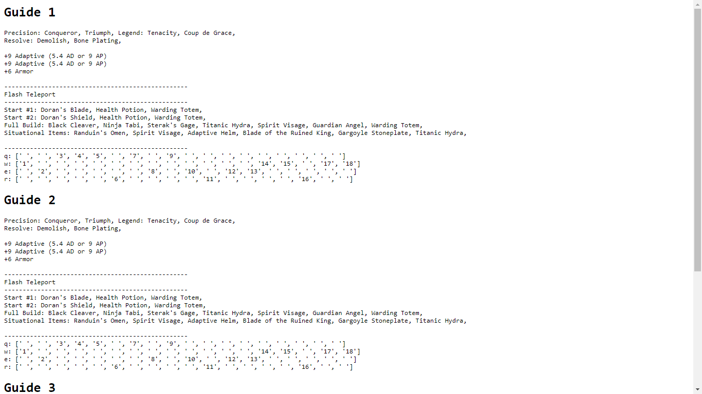

# MOBAFire-Web-Scraper
A web scraper that grabs runes, spells, items, and level order for any champion from the top 3 guides on MOBAFire

## Screenshot

## Challenges
### Getting the MOBAFire link

If you go on mobafire.com and search for a champion using the page's search function, the page with all the guides will have a URL with a (seemingly random) number at the end.

https://www.mobafire.com/league-of-legends/champion/vayne-76

That URL is also the first result of a Google search for "mobafire vayne" and "mobafire vayne guide". This led me to believe that I had to know the number for each champion. I got around this by going to leaguespy.gg to grab the link to MOBAFire.

I later found out that https://www.mobafire.com/league-of-legends/vayne-guide also takes me to the list of guides. Needless to say, removing the extra request to LeagueSpy sped up my program (by ~2 seconds).

### Multithreading vs. Multiprocessing

It was possible to parallelize the request and extraction tasks for each guide, but putting them on threads didn't help because of the GIL (Global Interpreter Lock). However, putting them on subprocesses resulted in faster performance.

### Multiprocessing Shared Variable

After putting each task on a process, I had to get the return value from each function. But each new process has its own instance of Python, so using a global list didn't work. Using `multiprocessing`'s Manager solved the problem of sharing data between different processes.

## Resources
http://automatetheboringstuff.com/2e/chapter12/  
http://automatetheboringstuff.com/2e/chapter17/  
https://stackoverflow.com/questions/10415028/how-can-i-recover-the-return-value-of-a-function-passed-to-multiprocessing-proce  
https://stackoverflow.com/questions/11055303/multiprocessing-global-variable-updates-not-returned-to-parent
https://stackoverflow.com/questions/110362/how-can-i-find-the-current-os-in-python
http://automatetheboringstuff.com/2e/chapter9/
