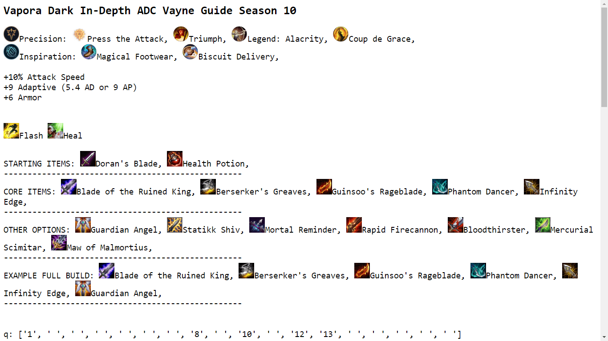
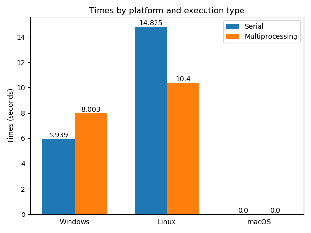

# MOBAFire-Web-Scraper
A web scraper that grabs runes, spells, items, and level order for any champion from the top 3 guides on MOBAFire.

The results are written to an HTML file ("lol.html"), which is automatically opened in the default web browser.

## Usage
Run script using serial execution: `python lol.py [-t] champion-name`  
Run script using multiprocessing: `python lolm.py [-t] champion-name`  
The `-t` option times the program and writes the time to a file called "times.txt". It also automatically runs "time_analysis.py", which saves a graph ("times.png").

Most common alternative champion names are handled, e.g. "cass", "tf", "jarvan", "nunu", "mundo".

Dependencies:
- requests
- bs4
- matplotlib (if running with the `-t` option)
- numpy (if running with the `-t` option)

## Screenshots

## Time Comparison (Serial Execution vs. Multiprocessing)

## Challenges
### Getting the MOBAFire link
If you go on mobafire.com and search for a champion using the page's search function, the page with all the guides will have a URL with a (seemingly random) number at the end. https://www.mobafire.com/league-of-legends/champion/vayne-76. That URL is also the first result of a Google search for "mobafire vayne" and "mobafire vayne guide". This led me to believe that I had to know the number for each champion. I got around this by going to leaguespy.gg to grab the link to MOBAFire.

I later found out that https://www.mobafire.com/league-of-legends/vayne-guide also takes me to the list of guides. Needless to say, removing the extra request to LeagueSpy sped up my program (by ~2 seconds).

### Multithreading vs. Multiprocessing
It was possible to parallelize the request and extraction tasks for each guide, but putting them on threads didn't help because of the GIL (Global Interpreter Lock).

However, putting them on subprocesses resulted in faster performance.

### Multiprocessing Shared Variable
After putting each task on a process, I had to get the result of the scrape from each function. But each new process has its own instance of Python, so using a global list didn't work.

Using `multiprocessing`'s Manager solved the problem of sharing data between different processes.

### Multiprocessing in Windows vs. Linux
Linux has a `fork()` method, so when a new process is created, the next line it executes is the line after it was created. On the other hand, Windows doesn't have a `fork()` method, so when a new process is created, it starts over from the beginning of the file. (This is probably why multiprocessing is actually slower on Windows.)

Protecting the code that creates new processes inside `if __name__ == '__main__':` prevents an infinite loop of process spawning.

### Writing Special Characters to HTML File
Some guides had titles with special characters. Like this title:「10.3」Carry with the Storm's Fury. Writing that string directly results in a `UnicodeEncodeError`.

This is fixed by converting the string to bytes (using `str.encode('utf-8')`) and opening the HTML file in binary mode.
(Converting the string to bytes and opening in text mode results in the string being written like this: b"\xe3\x80\x8c10.3\xe3\x80\x8dCarry with the Storm's Fury".)

## Resources
http://automatetheboringstuff.com/2e/chapter12/  
http://automatetheboringstuff.com/2e/chapter17/  
https://stackoverflow.com/questions/10415028/how-can-i-recover-the-return-value-of-a-function-passed-to-multiprocessing-proce  
https://stackoverflow.com/questions/11055303/multiprocessing-global-variable-updates-not-returned-to-parent
https://stackoverflow.com/questions/110362/how-can-i-find-the-current-os-in-python
http://automatetheboringstuff.com/2e/chapter9/  
https://stackoverflow.com/questions/20360686/compulsory-usage-of-if-name-main-in-windows-while-using-multiprocessi  
https://stackoverflow.com/questions/7974849/how-can-i-make-one-python-file-run-another  
https://stackoverflow.com/questions/5466451/how-can-i-print-literal-curly-brace-characters-in-python-string-and-also-use-fo/44636315  
https://stackoverflow.com/questions/2974022/is-it-possible-to-assign-the-same-value-to-multiple-keys-in-a-dict-object-at-onc
